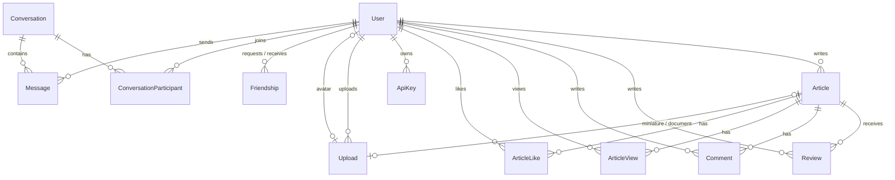

*This project has been created as part of the 42 curriculum by zoolszew, rlaigle and kaizatov.*

# OpenScholar

## Description

**OpenScholar** is an academic publishing platform. Its goal is to let students and researchers publish their work, have it reviewed by their peers, and discuss it with the community, all in one web application.

An article follows a simple life cycle: it is written as a **draft**, **submitted** for review, then **published** or **rejected** by another user. Published articles can be searched, read, liked and commented on, and every reader gets personalized recommendations based on what they read.

### Key features

- Email/password accounts, GitHub sign-in (OAuth 2.0) and optional two-factor authentication (TOTP)
- Rich-text article editor with drafts, thumbnails and PDF attachments
- Peer review workflow (approve / reject with a comment)
- Article search with sorting and pagination
- Likes, comments and ML-based recommendations
- User profiles, avatars, friends and online status
- Real-time private chat (Socket.IO)
- Personal activity dashboard
- Public REST API secured by API keys, with rate limiting and documentation
- Security: HTTPS, ModSecurity WAF, HashiCorp Vault, rate limiting
- Health check, status page and automated database backups

---

## Instructions

### Prerequisites

| Tool | Version |
|---|---|
| Docker Engine | recent version with Compose v2 (`docker compose`) |
| GNU Make | any |
| Google Chrome | latest stable version |
| A GitHub OAuth application | needed for "Sign in with GitHub" |

To create the GitHub OAuth application: GitHub → *Settings* → *Developer settings* → *OAuth Apps* → *New OAuth App*, with:
- Homepage URL: `https://localhost:8444`
- Authorization callback URL: `https://localhost:8444/api/auth/oauth/github/callback`

### Step 1: create the `.env` file

From the root of the repository, run:

```bash
make
```

The first run creates `platform/.env` from `platform/.env.example`, then stops so that you can fill it in. The `.env` file is ignored by Git and must never be committed.

### Step 2: fill in `platform/.env`

| Variable | Description |
|---|---|
| `POSTGRES_USER`, `POSTGRES_PASSWORD`, `POSTGRES_DB` | PostgreSQL credentials |
| `DATABASE_URL` | PostgreSQL connection string (must match the credentials above) |
| `REDIS_URL` | Redis URL (`redis://redis:6379` by default) |
| `BACKEND_URL` | Internal backend URL used by Next.js (`http://backend:4000`) |
| `SESSION_SECRET` | Secret used to sign session cookies. Generate it with `openssl rand -hex 32` |
| `GITHUB_CLIENT_ID`, `GITHUB_CLIENT_SECRET` | Credentials of your GitHub OAuth application |
| `GITHUB_CALLBACK_URL` | `https://localhost:8444/api/auth/oauth/github/callback` |
| `BACKUP_INTERVAL` | Seconds between two database backups (default `3600`) |
| `BACKUP_KEEP` | Number of backups kept (default `7`) |

At the first start, the secrets (`SESSION_SECRET`, GitHub credentials, `DATABASE_URL`) are copied into HashiCorp Vault, and the backend reads them from Vault.

### Step 3: start the project

```bash
make
```

This single command builds and starts every container. Then open **https://localhost:8444**.

The HTTPS certificate is self-signed, so the browser shows a warning the first time: accept it to continue.

### Useful commands

```bash
make        # Build and start the project
make down   # Stop the project
make logs   # Show logs
make ps     # Show container status
make re     # Rebuild everything from scratch and restart
make clean  # Remove containers and volumes (deletes the database)
```

More details about the health check, backups and restore, WAF and Vault are in [docs/infrastructure.md](docs/infrastructure.md). The public API is documented in [docs/api.md](docs/api.md).

---

## Team Information

| Member | Role(s) | Responsibilities |
|---|---|---|
| **zoolszew** | Tech Lead, Developer | Defined the architecture (Docker services, Next.js / Express split, first Prisma schema) and the technology stack, reviewed critical changes, built most of the frontend. |
| **kaizatov** | Project Manager (Scrum Master), Developer | Organized team meetings and the planning, tracked progress and blockers, wrote the documentation, built the real-time chat and online status. |
| **rlaigle** | Product Owner, Developer | Maintained the backlog and prioritized features, validated completed work and tested it, built most of the backend API, the public API and the security/infrastructure features. |

All three members are developers: everyone wrote code, tested their own features and reviewed the others' changes.

---

## Project Management

### Work organization

- **Planning:** the project was split into small tasks in a shared day-by-day plan with the task owner written next to each task. A progress file kept track of what was done and of important decisions.
- **Task distribution:** at the start, one person worked mainly on the backend and one on the frontend, with integration steps in between. Then each member took full features (chat, public API, infrastructure, friends, uploads…) from backend to frontend.
- **Meetings:** regular team meetings at 42 to sync on progress, split the next tasks and solve blockers together.
- **Code reviews:** important changes (database schema, authentication, merges between branches) were reviewed by another member before being merged.

### Tools

- **GitHub:** one branch per feature or area (`backend`, `front`, `chat`, `chatbox`, `friends`…), merged into the shared branches once working.
- **Shared Markdown plan** in the repository for the backlog and the planning.

### Communication

- **Discord** for daily communication and quick questions.
- **In person at 42** for meetings, pair programming and debugging sessions.

---

## Technical Stack

### Frontend

- **Next.js 16 / React 19** with TypeScript
- **Tailwind CSS 4** for styling, with **shadcn/ui** components (built on Base UI)
- **lucide-react** for icons
- **socket.io-client** for real-time features
- **DOMPurify** to sanitize the HTML of articles before rendering it

### Backend

- **Express 5** with TypeScript
- **Prisma 7** (ORM) with **PostgreSQL**
- **Redis** for sessions (`connect-redis`), online users and caching
- **Socket.IO** for real-time chat and online status
- **bcrypt** (password hashing), **otplib** + **qrcode** (2FA), **helmet**, **express-rate-limit**
- **multer** + **file-type** for uploads
- **Hugging Face Transformers.js** (`all-MiniLM-L6-v2`) for article embeddings

### Infrastructure

- **Docker Compose**, started with a single `make`
- **Nginx** as the HTTPS entry point and reverse proxy
- **ModSecurity + OWASP CRS** as the Web Application Firewall
- **HashiCorp Vault** for secrets
- A dedicated **backup** container (`pg_dump`)

### Justification of the main choices

- **Next.js + Express:** Next.js gives us routing, server components and a big ecosystem for the UI. Keeping a separate Express API makes the backend usable by any client (our frontend, scripts, the public API) and keeps responsibilities clear.
- **TypeScript everywhere:** one language for the whole team, and types shared between the API responses and the frontend.
- **PostgreSQL:** our data is strongly relational (users, articles, reviews, comments, friendships, conversations). PostgreSQL gives us foreign keys, unique constraints and transactions, which prevent duplicates and race conditions when several users act at the same time. It also stores the embedding vectors as `Float[]`.
- **Prisma:** a typed client and versioned migrations, so the schema is the same on every machine.
- **Redis:** fast in-memory storage, ideal for sessions shared between requests and for the list of online users.
- **Socket.IO:** WebSockets with automatic reconnection and rooms, which makes private messaging and presence simple to implement.
- **Nginx + ModSecurity:** a single HTTPS entry point for the whole application, with a firewall in front of it.

### Architecture

```text
Browser ──HTTPS──> Nginx + ModSecurity (port 8444)
                     ├── /            → Next.js (frontend)
                     ├── /api/*       → Express (backend API)
                     ├── /socket.io/* → Express (Socket.IO)
                     └── /health, /status → Express
Express ──> PostgreSQL (data)   Redis (sessions, online users, cache)   Vault (secrets)
Backup container ──> PostgreSQL (pg_dump every hour)
```

---

## Database Schema

The schema is defined in [platform/backend/prisma/schema.prisma](platform/backend/prisma/schema.prisma) and versioned with Prisma migrations.



| Table | Key fields | Relations |
|---|---|---|
| **User** | `id` (cuid), `email` (unique), `name`, `password` (bcrypt hash, null for GitHub accounts), `faculty`, `specialization`, `twoFactorSecret`, `twoFactorEnabled` (bool), `oauthProvider` + `oauthId` (unique pair) | has articles, reviews, comments, uploads, API keys, friendships, conversations, messages; optional avatar (`Upload`) |
| **Article** | `id`, `title`, `abstract`, `content` (HTML), `status` (`DRAFT` / `SUBMITTED` / `REJECTED` / `PUBLISHED`), `embedding` (`Float[]`), `miniatureFocusX/Y` (float) | belongs to an author (`User`); optional miniature and document (`Upload`); has reviews, comments, views, likes |
| **Review** | `id`, `status` (`PENDING` / `APPROVED` / `REJECTED`), `comment` | one article, one reviewer; unique on (`articleId`, `reviewerId`) |
| **Comment** | `id`, `content` | one article, one author |
| **ArticleView** / **ArticleLike** | `id`, `createdAt` | one user, one article; unique on (`userId`, `articleId`) |
| **Friendship** | `id`, `status` (`PENDING` / `ACCEPTED`) | requester and addressee (`User`); unique on (`requesterId`, `addresseeId`) |
| **Conversation** | `id`, `directKey` (unique, sorted pair of user ids) | has participants and messages |
| **ConversationParticipant** | primary key (`conversationId`, `userId`), `joinedAt` | one conversation, one user |
| **Message** | `id`, `content`, `readAt` (nullable, for unread counters) | one conversation, one sender |
| **ApiKey** | `id`, `keyHash` (SHA-256, unique) | one user |
| **Upload** | `id`, `filename`, `originalName`, `mimeType`, `size` (int), `visibility` (`PUBLIC` / `PRIVATE`) | one owner; can be an avatar, an article miniature or an article document |

---

## Features List

| Feature | Description | Member(s) |
|---|---|---|
| Sign up / log in | Email + password accounts, passwords hashed and salted with bcrypt, sessions stored in Redis, inputs validated on both sides | rlaigle (backend), zoolszew (pages) |
| GitHub OAuth | "Sign in with GitHub" with the OAuth 2.0 authorization code flow | rlaigle (backend), zoolszew (button and flow) |
| Two-factor authentication | TOTP 2FA with a QR code for authenticator apps, enable / disable from the profile, code asked at login | zoolszew, rlaigle |
| Article editor | Rich-text editor, drafts saved automatically, thumbnail with adjustable focus point, optional PDF document | zoolszew (frontend), rlaigle (backend) |
| Peer review | Submitted articles go to a review queue; another user approves or rejects them with a comment | zoolszew (frontend), rlaigle (backend) |
| Explore and search | List of published articles with text search, sorting (newest / oldest) and pagination; search users by name | zoolszew (frontend), rlaigle (backend) |
| Comments and likes | Comment and like published articles | zoolszew (frontend), rlaigle (backend) |
| Recommendations | "Discover" and "Deepen" lists of articles computed from embeddings and user activity | rlaigle (algorithm), zoolszew (page) |
| File upload | Images (PNG, JPEG, WebP) and PDF, type/size/signature checks, progress bar, image preview, removal, private/public access | zoolszew (frontend), rlaigle (backend) |
| Profiles | Profile page of any user, edit own information and avatar (default avatar if none) | kaizatov (`/users/[id]`), zoolszew (profile editing) |
| Friends | Send, accept, refuse and remove friend requests, friends list with online status | zoolszew |
| Real-time chat | Private conversations, chat page and chat dock on every page, unread counters, online status, accessible and responsive | kaizatov |
| Activity dashboard | Personal statistics: articles by status, reviews done, approval rate, days since joining | zoolszew (frontend), rlaigle (backend) |
| Public API | API keys (hashed), rate limiting, documentation in `docs/api.md` | rlaigle |
| Security | HTTPS, ModSecurity WAF (OWASP CRS), Vault for secrets, helmet, rate limiting | rlaigle |
| Health and backups | `/health` and `/status` pages, automated PostgreSQL backups and documented restore procedure | rlaigle |
| Privacy Policy and Terms of Service | Pages linked from the footer of every page | kaizatov |
| Docker setup | Containers for every service, started with one command | zoolszew (initial setup), rlaigle (Nginx, Makefile) |

---

## Modules

| # | Module (subject name) | Type | Points | Member(s) |
|---|---|---|---:|---|
| 1 | Use a framework for both the frontend and backend | Major | 2 | all |
| 2 | Real-time features using WebSockets | Major | 2 | kaizatov |
| 3 | Allow users to interact with other users | Major | 2 | kaizatov, zoolszew |
| 4 | Public API with secured API key | Major | 2 | rlaigle |
| 5 | Standard user management and authentication | Major | 2 | zoolszew, kaizatov |
| 6 | Recommendation system using machine learning | Major | 2 | rlaigle, zoolszew |
| 7 | WAF/ModSecurity (hardened) + HashiCorp Vault | Major | 2 | rlaigle |
| 8 | Use an ORM for the database | Minor | 1 | all |
| 9 | Advanced search functionality | Minor | 1 | rlaigle, zoolszew |
| 10 | File upload and management system | Minor | 1 | zoolszew, rlaigle |
| 11 | Custom-made design system | Minor | 1 | zoolszew |
| 12 | Remote authentication with OAuth 2.0 | Minor | 1 | rlaigle, zoolszew |
| 13 | Complete 2FA system | Minor | 1 | zoolszew, rlaigle |
| 14 | User activity analytics and insights dashboard | Minor | 1 | zoolszew, rlaigle |
| 15 | Support for additional browsers | Minor | 1 | all |
| 16 | Health check and status page with automated backups and disaster recovery | Minor | 1 | rlaigle |
| | **Total: 7 Major + 9 Minor** | | **23** | |

### Why and how each module was implemented

**1. Frameworks (frontend + backend).** We wanted a structured codebase that three people can work on at the same time. *How:* Next.js (App Router) for the frontend and Express 5 for the backend, both in TypeScript.

**2. WebSockets.** A chat and an online status must update instantly without reloading the page. *How:* Socket.IO server attached to the Express HTTP server, authenticated with the same session cookie as the API. Each user joins a personal room, so a message is sent only to its recipient (`message:new`). Online users are stored in Redis and a user stays online as long as one tab is open. Disconnections and logouts are handled (the socket is closed on logout), and Socket.IO reconnects automatically.

**3. User interaction.** An academic platform is about exchanging with other people. *How:* private chat (send / receive messages, history stored in PostgreSQL), profile page for every user, friends system (add, accept, remove, friends list).

**4. Public API.** Researchers or tools can use the platform from scripts. *How:* users generate API keys (`POST /api/auth/api-keys`); only the SHA-256 hash is stored. Requests use `Authorization: Bearer <key>`. Global rate limiting with `express-rate-limit` plus a stricter limit on login/register. More than 5 endpoints with GET, POST, PUT and DELETE (articles, friends, uploads…), documented in [docs/api.md](docs/api.md).

**5. Standard user management.** *How:* users can edit their name, faculty and specialization, upload an avatar (a default avatar is shown otherwise), add friends and see their online status, and every user has a profile page.

**6. Recommendation system (ML).** With many articles, readers need help to find the ones that match their interests. *How:* content-based filtering. When an article is created or updated, its title and content are turned into a 384-dimension vector with the `all-MiniLM-L6-v2` sentence-embedding model (Transformers.js, run locally). Each user gets a *reader profile*: the weighted average of the vectors of the articles they interacted with (view = 1, like = 2, comment = 2, review = 3). Articles are ranked by cosine similarity with this profile ("Discover"). A second list ("Deepen") uses the *author profile* built from the user's own published articles. Recommendations improve over time because each new view, like, comment or review changes the profile.

**7. WAF + Vault.** User-generated HTML content and file uploads make the application a target. *How:* ModSecurity with the OWASP Core Rule Set in blocking mode, paranoia level 2, with only a few targeted exclusions (article HTML content, OAuth parameter). The WAF is disabled on `/socket.io/` only, because it broke the long-lived chat connections; this path receives no user data (messages are sent through `POST /api/chat/:userId`, which the WAF inspects), see [docs/infrastructure.md](docs/infrastructure.md#exception-socketio). Vault is initialized and unsealed automatically at startup; secrets are stored in a KV v2 engine and the backend reads them with a read-only token at startup. Details in [docs/infrastructure.md](docs/infrastructure.md).

**8. ORM.** *How:* Prisma 7 with a typed client and versioned migrations in `platform/backend/prisma/migrations`.

**9. Advanced search.** *How:* text search on title and content, sorting (newest / oldest), pagination with total pages, status filter on the user's own articles, search of users by name. Results of the public list are cached in Redis.

**10. File upload.** *How:* images (PNG, JPEG, WebP) and PDF documents, validated in the browser (type, size, file signature) and on the server (multer limits, MIME type, file content). Uploads are private by default and become public only when attached to a published article or used as an avatar. Progress bar during upload, preview of images (thumbnail with focus point) and a "View PDF" link for documents. A thumbnail or PDF can be removed from an article in the editor, and the owner of a file can delete it with `DELETE /api/uploads/:id`.

**11. Design system.** A consistent look across all pages. *How:* design tokens in [globals.css](platform/app/app/globals.css) (color palette in OKLCH with light and dark values, radius scale, Geist Sans / Geist Mono typography), lucide icons, and reusable components: `Button`, `Input`, `Card`, `Badge`, `Avatar`, `Dialog`, `PageShell`, `PageHeading`, `NavLink`, `ArticleCard`, `ArticleMiniature`, `ErrorPage`, `StatsSection`, `UploadProgress`, `OnlineDot`, `SiteFooter`.

**12. OAuth 2.0.** Most students already have a GitHub account. *How:* authorization code flow with a `state` parameter against CSRF; the GitHub account is linked with `oauthProvider` + `oauthId`.

**13. 2FA.** *How:* TOTP (otplib). The user scans a QR code, confirms with a 6-digit code to enable 2FA, and is then asked for a code at every login. 2FA can be disabled with a valid code. These routes are rate limited.

**14. User activity analytics dashboard.** Authors want to follow their activity. *How:* `/api/dashboard` aggregates the user's articles by status, reviews done, approval rate and seniority; displayed on the dashboard page.

**15. Additional browsers.** *How:* every feature (authentication, editor, uploads, chat, friends, dashboard) was tested on Google Chrome (reference browser) and on two additional browsers: **Mozilla Firefox** (Gecko engine) and **Brave** (Chromium engine). No browser-specific limitation was found. Notes: on first visit, each browser shows its own warning for the self-signed certificate; Brave Shields must stay compatible with first-party cookies (the default setting), because sessions rely on a cookie.

**16. Health check and backups.** *How:* `/health` (JSON, `200` or `503`) and `/status` (HTML page refreshed every 30 s) check the backend, PostgreSQL and Redis with a timeout. A backup container dumps the database every hour and keeps the last 7 dumps. The restore procedure is documented and tested in [docs/infrastructure.md](docs/infrastructure.md).

---

## Individual Contributions

### zoolszew (Tech Lead, Developer)

- Initial Docker setup (Next.js, PostgreSQL, Redis, backend containers) and first Prisma schema and migrations
- Most of the frontend: home, login/register, explore and article pages, rich-text editor and publish form, drafts, review queue, dashboard, error pages
- Reusable UI components and design system
- File upload on the frontend: validation, progress bar, thumbnails with focus point, PDF documents
- Friends system (backend and frontend), profile editing and statistics
- 2FA, likes and recommendations pages on the frontend
- Merges between the `front` and `backend` branches

**Challenges:** connecting the frontend to the backend routes when both were developed in parallel (solved with a shared API client and shared TypeScript types), and production build errors caused by `useSearchParams` in Next.js (solved by wrapping these pages in `Suspense`).

### rlaigle (Product Owner, Developer)

- Most of the backend API: authentication, articles, reviews, comments, uploads, users, validation and error handling
- GitHub OAuth and 2FA backend
- Public API: API keys, rate limiting, `docs/api.md` documentation, HTTP test requests
- Recommendation system with embeddings and likes
- ModSecurity WAF, HashiCorp Vault, Nginx configuration
- Health check, status page, automated backups and disaster recovery procedure
- Backlog, Makefile and testing

**Challenges:** storing API keys securely (only a hash is kept, the key is shown once), and false positives of the WAF on article HTML content, solved with targeted rule exclusions instead of disabling rules.

### kaizatov (Project Manager, Developer)

- Real-time chat: Socket.IO server and rooms, conversations and messages (backend and frontend), chat page and chat dock on every page, unread counters
- Online status shared by the chat and the friends list
- Public profile page (`/users/[id]`) with a button to start a conversation
- Responsive and accessible chat (keyboard, focus, `aria-live`)
- Privacy Policy and Terms of Service pages
- Planning, meetings, documentation (`docs/chat`, README)

**Challenges:** keeping the online status correct when a user has several tabs open (a user is online as long as one socket remains), and keeping messages and unread counters synchronized in real time with a single socket shared by the whole site.

---

## Known Limitations

- The HTTPS certificate is self-signed: the browser shows a warning on first visit.
- Sessions are stored in Redis, which is not backed up: after a database restore, users must log in again.
- Recommendations need at least a few interactions; new users first get the most recent articles.

---

## Resources

- Next.js: https://nextjs.org/docs
- React: https://react.dev
- Express: https://expressjs.com
- Prisma: https://www.prisma.io/docs
- PostgreSQL: https://www.postgresql.org/docs/
- Socket.IO: https://socket.io/docs/v4/
- Tailwind CSS: https://tailwindcss.com/docs
- shadcn/ui: https://ui.shadcn.com/docs
- GitHub OAuth: https://docs.github.com/en/apps/oauth-apps/building-oauth-apps/authorizing-oauth-apps
- TOTP (RFC 6238): https://datatracker.ietf.org/doc/html/rfc6238
- OWASP CRS: https://coreruleset.org/docs/
- HashiCorp Vault: https://developer.hashicorp.com/vault/docs
- Transformers.js: https://huggingface.co/docs/transformers.js
- Sentence embeddings (all-MiniLM-L6-v2): https://huggingface.co/sentence-transformers/all-MiniLM-L6-v2

### Use of AI

AI tools were used as assistants, and every generated content was reviewed, tested and understood by the team before being kept:
- Drafting the Privacy Policy and Terms of Service, then adapting them to the real features of the project
- Drafting and translating documentation (README, `docs/`)
- Explaining error messages and unfamiliar concepts (Prisma 7 configuration, Socket.IO, ModSecurity rules)
- Reviewing code and checking the project against the subject
